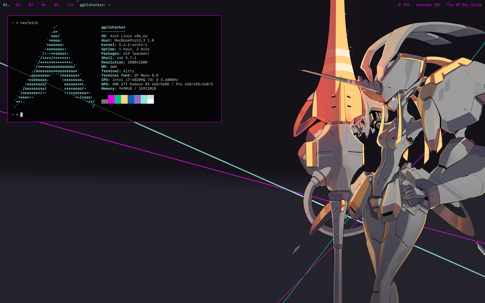
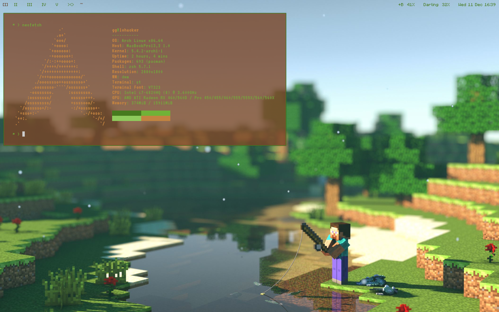
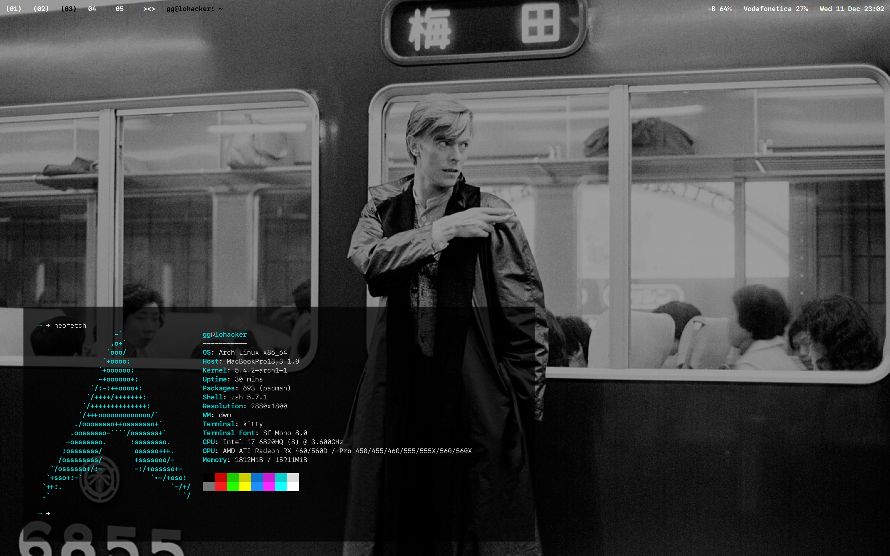

In this repo are stored the config files, palettes and diffs of my rices.
1. Darling in the FRANXX
2. Minecraft
3. David Bowie B/W
4. Crimson

To recreate any of my rices download the needed tools from suckless and apply the diffs before compiling, for tools like kitty you only have to swap or merge the config files. If there are any issues download the tool's version at commit time and not the latest.

Tools
-----

By [suckless](https://suckless.org/):
- [dwm](https://dwm.suckless.org/)
- [st](https://st.suckless.org/)
- [slstatus](https://tools.suckless.org/slstatus/)
- [dmenu](https://tools.suckless.org/dmenu/)
- [Kitty](https://sw.kovidgoyal.net/kitty/)

By [Dylan Arps](https://github.com/dylanaraps):
- [Neofetch](https://github.com/dylanaraps/neofetch)
- [pywal](https://github.com/dylanaraps/pywal)

Pics
----

